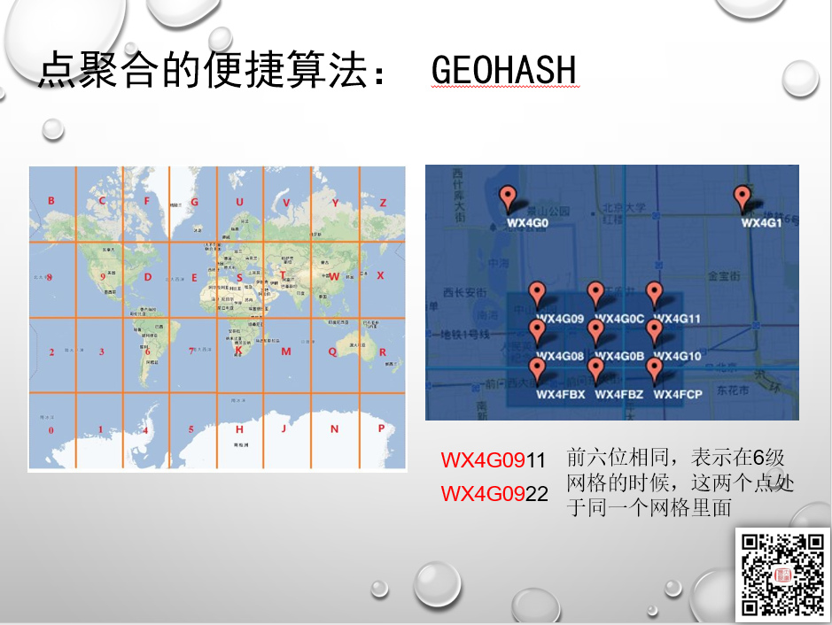
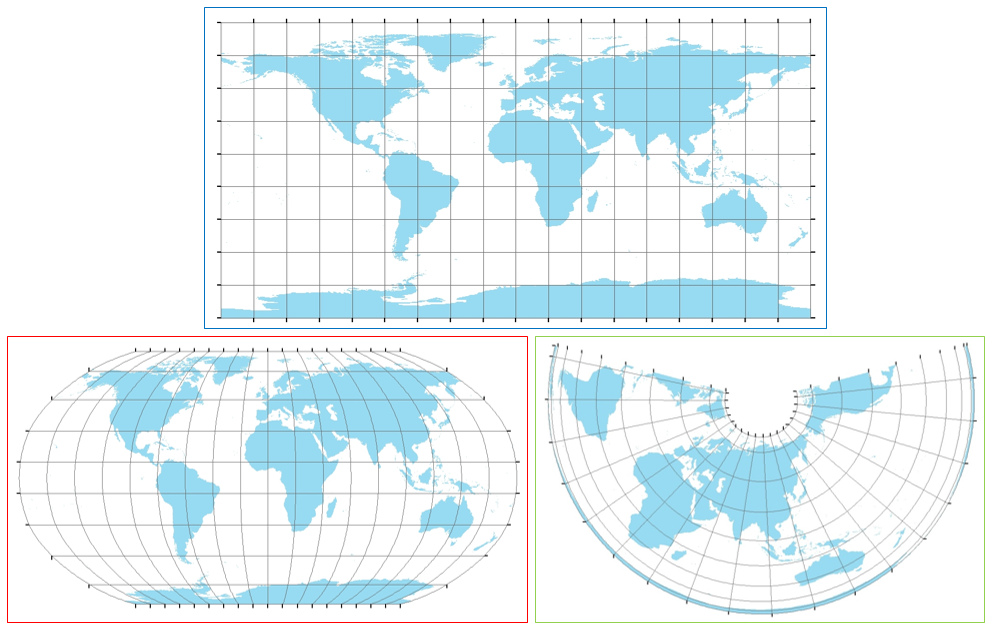
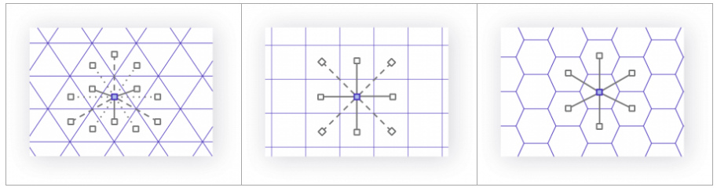
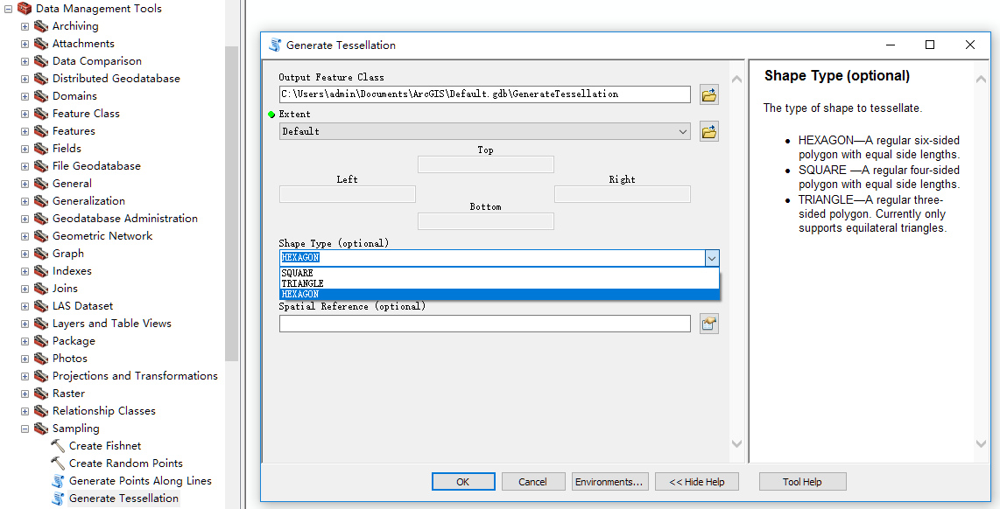
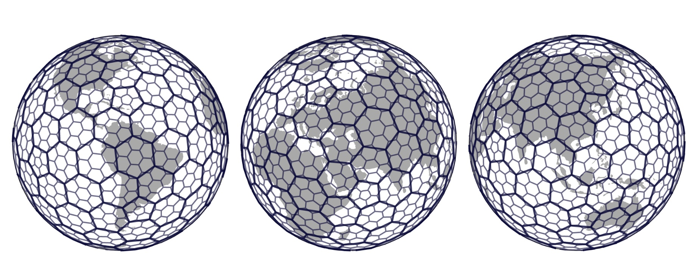
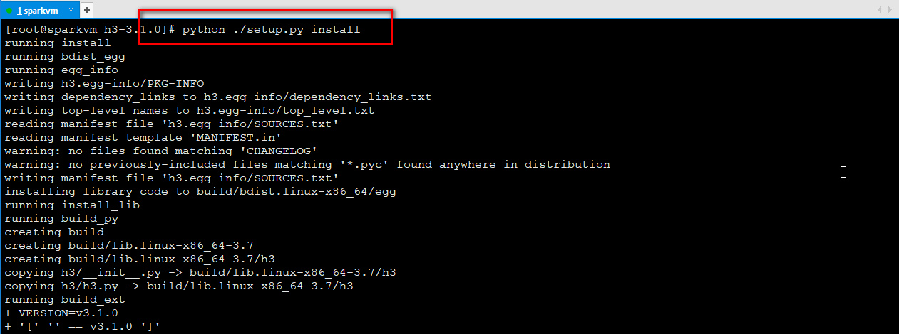
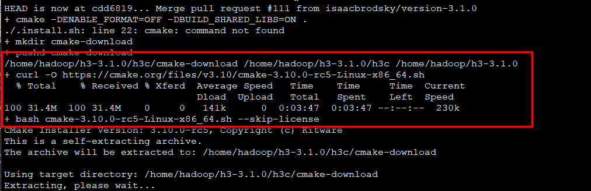
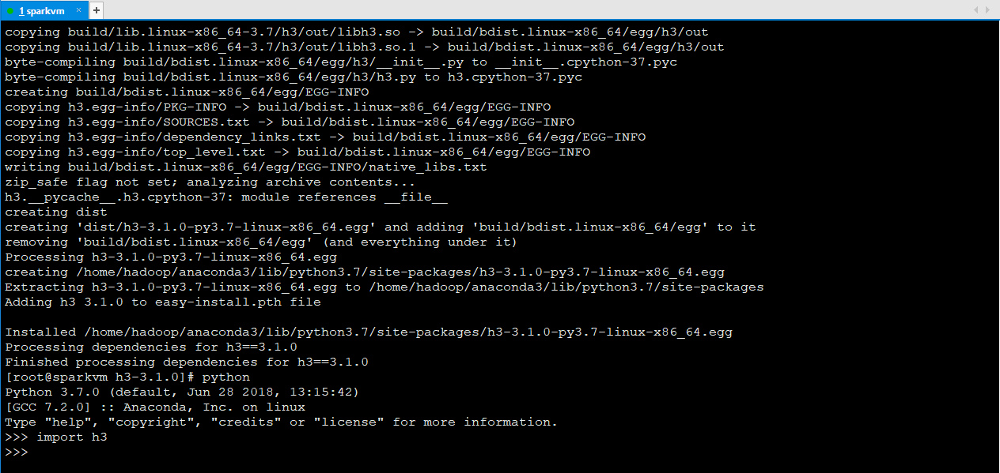
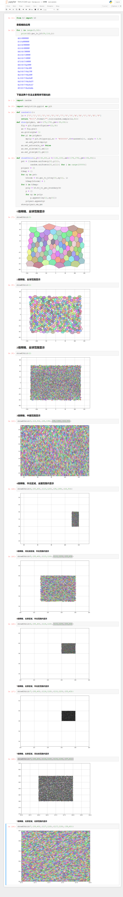
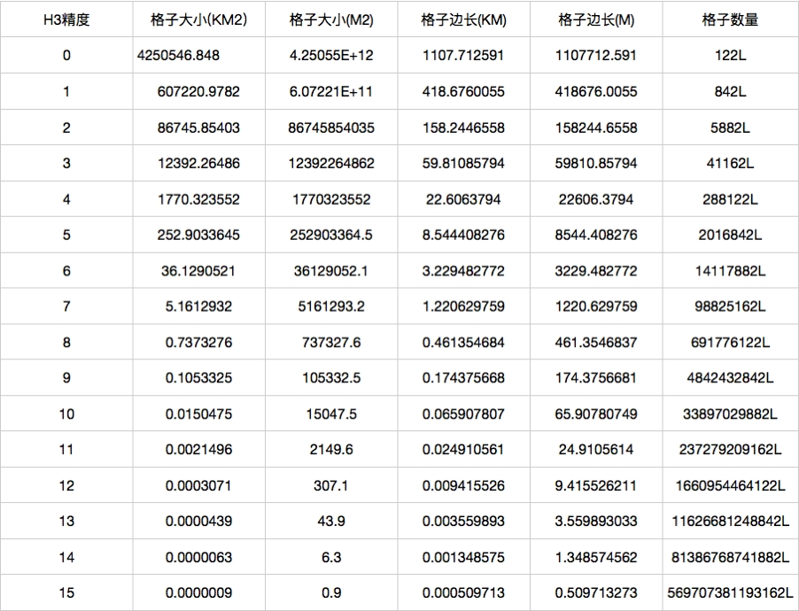

# Uber H3算法实现蜂窝六边形聚合

比之前些年不同，蜂窝多边形是近几年点数据聚合的主要趋势。

经纬度的聚合最早也最常用的方式的geohash：

GeoHash的原理就是按照区域，把经纬度进行编码，按照不同的网格精度，变成不同位数的编码，在同一区域中的编码相同。

比如上图里面的那个例子，如果两个坐标的前6位相同，那么表示在第六级精度格网上，两个坐标处于同一个格网。这样，我们就可以按照编码的内容，按照不同的精度聚合位置点数据了。

但是geohash一类的矩形算法，有以下两个显著的缺陷：

1、在不同纬度的地区会出现地理单元单位面积差异较大的情况：

2、在常用的地理范围查询中，基于矩形的查询方法，存在8邻域到中心网格的距离不相等的问题，也就是说六边形网格与周围网格的距离有且仅有一个，而四边形存在两类距离，三角形有三类距离：

六边形的周围邻居到中心网格的距离却是相等的，从形状上来说更加接近于圆形。而且六边形也是边数最多的无缝多边形。

所以，基于hexagon的地理单元已经成为各大厂家的首选，比如 Uber 和 Didi 的峰时定价服务。

这种这种背景下，六边形的应用也来越广，比如ArcGIS Desktop在10.3之后，专门内置生成蜂窝多边形的工具：

而且我以前也写过一遍，如何自己制作蜂窝多边形的算法：

<a href="https://blog.csdn.net/allenlu2008/article/details/50996972">ArcGIS中生成蜂窝多边形生成算法解析
https://blog.csdn.net/allenlu2008/article/details/50996972
</a>

而如果想要在比如Spark中实现蜂窝多边形聚合，怎么办呢？Uber开源了他的蜂窝多边形算法H3，让我们能够非常轻松的完成这个任务：

具体算法和论文的地址：
https://eng.uber.com/h3/

算法什么的，我这里就不去做解析，贯彻拿来主义和学以致用的原则，这里主要给大家介绍一下这个算法包的用法。

首先这个包是用C写的，要在Python上用，就必须要gcc和make来进行编译，目前在Windows上木有编译成功，所以我就直接安装到了linux上面。

你也可以用pip进行安装，但是用pip安装的话，里面还有一些乱七八糟的编译过程可能会出问题，所以我这里直接用下载了源码包，用setuptools进行安装，如果你的系统里面没有cc、make和cmake的话，这个包还会自动给你安装，比如我这里还自动给安装了一个cmake：

最后经过一系列的编译，完成安装：

python包的地址：

https://pypi.org/project/h3/

安装完之后，我们来测试一下效果：

看第一级格网的时候，可以显著的发现，不同纬度，格网的大小是不同的，而随着级别增加，粒度更细的时候，网格的大小趋近与相等——实际上学过投影与坐标系的同学都知道，投影坐标系在大比例尺的时候，形变级别就可以忽略不计了。

最后给出h3的格网分级粒度：

需要进行哪个级别的聚合，只需要选择不同的精度就行，关键这个接口计算完成之后，还可以恢复回六边形的JSON坐标串，直接可以进行生成数据和可视化。真是居家旅行，杀人灭口必备之物。

下面给出H3的github地址，更多内容大家可以自行查阅

https://uber.github.io/h3/#/

里面有多种代码的实现：

大家按需取用。

上文中的代码，大家可以在我的github中自行下载：

